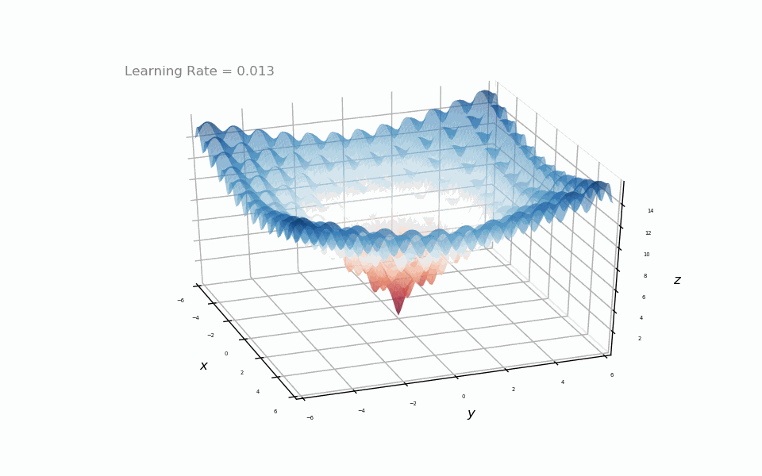

# AML_2019 Coursework Group 18
SMM284 Applied Machine Learning Coursework submission which explores the implementation, behaviour and variants of Gradient Descent on complex functions.

## Simple Explanation of Gradient Descent

### Why is gradient descent important in machine learning? 
Gradient Descent is an optimisation algorithm for machine learning. Gradient Descent helps us find the smallest value (or when the descent ends or is trapped in a local minima) of a cost function. The optimisation process is done via adjusting the weights/values of the parameters, where this adjustment is determined by the learning rate set.  This cost function acts as inaccuracy within our machine learning model or deviations from the true value. 

### How does plain vanilla gradient descent work?
Think of a mountain range and at the lowest points of these mountain ranges, we have diamonds *[diamonds = ideal parameters at minima]*. Now take a person, Bob starting at any point of these mountains blindfolded *[Not knowing every value for every possible parameter]*. Bob takes one step at a time *[Greedy algorithm and each step within each update to parameters, size of steps are learning rate]*, in whichever direction that he feels is descending fastest.  Eventually Bob will reach the bottom or he runs out of energy *[limitation to iteration loops (or computational limitations)]*.

### Two modifications to plain vanilla gradient descent.
Now we already understand plain vanilla gradient descent from the analogy above, expanding on that analogy we introduce momentum and adam. **Momentum** can be thought of as a big ball rolling down the mountain, the longer it rolls downhill, the more acceleration it picks up. We gain faster convergence and reduced oscillation **Adam** can be thought of the same ball rolling down the hil, but now we account for friction. This friction exist in the form of past decaying gradients from the first and second moment.

## Exploration of step size effect on Plain Vanilla Gradient Descend

Note here that the large step size bounced around to find the minima and the small step sizes took more iterations to find the minima.

| **Step Size** | Large | Medium | Small |
|---------------|-------|--------|-------|
| **Converged in (steps)** | 26 | 37 | 412 |
| **Loss Function point** | -1.2029 | -1.7330 | -1.7330 |
| **Achieved local minima?** | No | Yes | Yes |

   

**Ackley Function** 
Here we demonstrate the ability of the plain vanilla gradient descend to overcome numerous local minima due to a sufficiently large step size (learning rate). Of course this causes problems as it approaches the global minima (bouncing around and missing it).

Here we see the descent getting stuck in the local minima. Notice the learning rate is significantly smaller.

## Variants of Gradient Descent Experiment

**Noisy Hill Function** 

| | Converged in (steps) | Loss Function point | Coordinate of minima |
|---------------|-------|--------|-------|
| [Plain Vanilla](#How-does-plain-vanilla-gradient-descent-work?) | 499 | -0.9999 | (0.0082, -0.0133) |
| [Momentum](http://ruder.io/optimizing-gradient-descent/index.html#momentum) | 194 | -1.0000 | (0.0000, -0.0000) |
| [Adam](http://ruder.io/optimizing-gradient-descent/index.html#adam) | 232 | -1.3188 | (0.9365, -0.9703) |
| [AdaMax](http://ruder.io/optimizing-gradient-descent/index.html#adamax) | 250 | -1.3188 | (0.9368, -0.9703) |
| [Nadam](http://ruder.io/optimizing-gradient-descent/index.html#nadam) | 199 | -1.3188 | (0.9368, -0.9703) |
| [AMSGrad](http://ruder.io/optimizing-gradient-descent/index.html#amsgrad) | 216 | -1.3188 | (0.9368, -0.9703) |
| [Nesterov accelerated gradient](http://ruder.io/optimizing-gradient-descent/index.html#nesterovacceleratedgradient) | 134 | -1.0000 | (-0.0001, 0.0001) |
| [RMSprop](http://ruder.io/optimizing-gradient-descent/index.html#rmsprop) | 133 | -1.3188 | (0.9369, -0.9703) |

   

**Six Hump Function** 
In this case, many of the variants get caught in a ditch just before the hump. Only Nag and Momentum managed to overcome this due to the accelerated build up from the initial descend.

Using a different startpoint, we can see again nag and momentum overcome the hump. The remaining variants manage to diverted to a different and deeper minima 

| | Converged in (steps) | Loss Function point | Coordinate of minima |
|---------------|-------|--------|-------|
| [Plain Vanilla](#How-does-plain-vanilla-gradient-descent-work?) | 201 | -1.0316 | (0.0898, -0.7127) |
| [Momentum](http://ruder.io/optimizing-gradient-descent/index.html#momentum) | 196 | -0.2155 | (-1.7036, 0.7961) |
| [Adam](http://ruder.io/optimizing-gradient-descent/index.html#adam) | 225 | -1.0316 | (0.0900, -0.7127) |
| [AdaMax](http://ruder.io/optimizing-gradient-descent/index.html#adamax) | 259 | -1.0316 | (0.0899, -0.7127) |
| [Nadam](http://ruder.io/optimizing-gradient-descent/index.html#nadam) | 206 | -1.0316 | (0.0900, -0.7127) |
| [AMSGrad](http://ruder.io/optimizing-gradient-descent/index.html#amsgrad) | 139 | -1.0316 | (0.0932, -0.7128) |
| [Nesterov accelerated gradient](http://ruder.io/optimizing-gradient-descent/index.html#nesterovacceleratedgradient) | 80 | -0.2155  | (-1.7036, 0.7961) |
| [RMSprop](http://ruder.io/optimizing-gradient-descent/index.html#rmsprop) | 299 | -1.0313 | (0.0948, -0.7076) |

